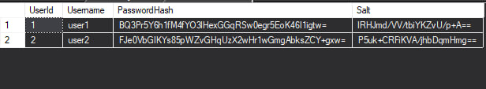

# Authorization
Authorization form with WPF and C#

This authorization form has login and registration functions with additional hashing and salting. 
Attention! AppContext.cs doesn't have Data Source path in OnConfiguring function. Add your path from SQL Server to UseSqlServer method.

Salt's work example: both users have same password but different hash

